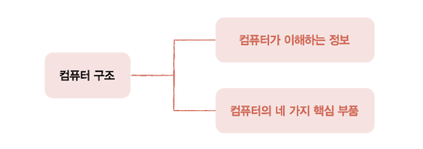
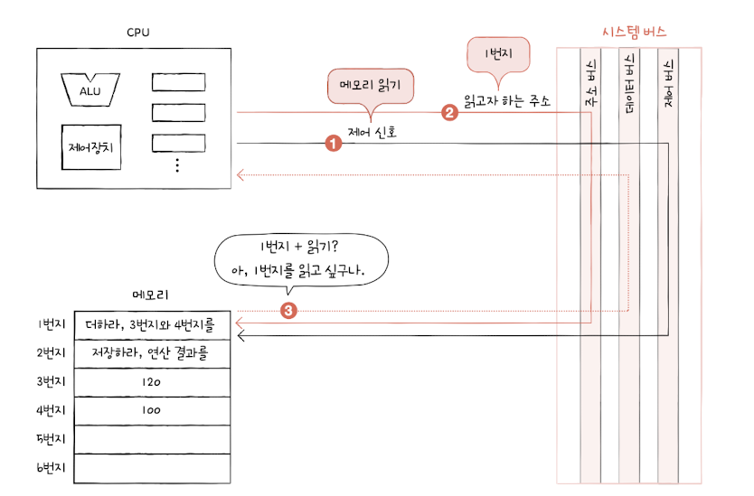

# 컴퓨터 구조

## 컴퓨터 구조를 알아야 하는 이유
좋은 개발자가 되기 위해서는 **컴퓨터의 근간** 을 알아야한다. (CS 지식)

1. 문제 해결

   거리낌없이 **컴퓨터를 분석** 하는 능력을 길러야 한다.

   동일한 코드를 작성하더라도 코드가 제대로 작동하지 않는 경우는 비일비재하다.

   

   이때 문제 해결의 실마리는 컴퓨터 자체에서 찾아야 한다.

   컴퓨터 (미지의 대상 -> 분석의 대상) / 컴퓨터를 관조할 수 있는 능력 배양

2. 성능, 용량, 비용
   
   **성능, 용량, 비용** 을 고려한 프로그래밍을 해야한다.

   사용자가 존재하는 프로그램은 필연적으로 성능, 용량, 비용이 고려된다.

   상황에 적절한 컴퓨터를 스스로 판단하고 고를 수 있어야 한다.

   

   클라우드 서비스를 이용하더라도 결국 같은 문제를 고민해야 한다.

    | 컴퓨터 구조는 결국 **성능, 용량, 비용** 에 대한 이야기이다.

3. 결론

     - 컴퓨터 구조를 이해하면 **문제 해결** 능력을 향상시킬 수 있다.
     - 컴퓨터 구조를 이해하면 문법만으로는 알기 어려운 **성능/용량/비용** 을 고려한 개발을 할 수 있다.

## 컴퓨터 구조의 큰 그림
컴퓨터 구조의 큰 그림을 이해해보자.

크게 두 가지 부분으로 컴퓨터 구조를 배운다.

### 컴퓨터가 이해하는 정보

컴퓨터는 0과 1로 표현된 정보만을 이해한다.

그리고 이렇게 0과 1로 표현되는 정보에는 크게 두 종류가 있는데, **데이터** 와 **명령어** 이다.

#### 데이터
- 숫자, 문자, 이미지, 동영상과 같은 정적인 정보
- 컴퓨터와 주고받는/내부에 저장된 정보를 데이터라 통칭하기도 한다
- 0과 1로 숫자, 문자를 표현하는 방법

#### 명령어
- 컴퓨터는 결국 명령어를 처리하는 기계
- 명령어는 컴퓨터를 실질적으로 움직이는 정보, 데이터는 명령어를 위한 일종의 재료
- 컴퓨터 프로그램은 '명령어들의 모음'으로도 볼 수 있다
- 명령어의 생김새와 동작 방식

### 컴퓨터의 4가지 핵심 부품
컴퓨터를 이루고 있는 네 가지 핵심 부품은 중앙처리장치(CPU), 주기억장치(메모리), 보조기억장치, 입출력장치이다.

주기억장치에는 크게 **RAM(Random Access Memory)** 과 **ROM(Read Only Memory)** , 두 가지가 존재한다.

메모리라는 용어는 보통 RAM을 지칭한다.

#### 컴퓨터 구조 간소화

#### 메모리
**메모리** 는 현재 실행되는 프로그램의 명령어와 데이터를 저장하는 부품이다.

즉, 프로그램이 실행되려면 반드시 메모리에 저장되어 있어야 한다.

메모리는 **주소(address)** 라는 개념을 통해 저장된 값에 빠르고 효율적으로 접근할 수 있다.

#### CPU
**CPU** 는 메모리에 저장된 명령어를 읽어 들이고, 읽어 들인 명령어를 해석하고, 실행하는 부품이다.

CPU의 핵심 내부 부품으로는 다음과 같이 3가지가 존재한다.
- 산술논리연산장치 (ALU, Arithmetic Logic Unit)
  
  ALU는 컴퓨터 내부에서 수행되는 대부분의 계산을 수행한다.
- 레지스터 (register)

  CPU 내부의 작은 임시 저장 장치이다. 프로그램을 실행하는 데 필요한 값들을 임시로 저장한다.
- 제어장치 (CU, Control Unit)

  **제어 신호(control signal)** 라는 전기 신호를 내보내고 명령어를 해석하는 장치이다.
  
  ex) 메모리에 저장된 값을 읽거나 저장하기 위해서 CPU는 메모리에 제어 신호(메모리 읽기, 쓰기)를 보낸다.

#### 보조기억장치
주기억 장치는 가격이 비싸 저장 용량이 적고, 전원이 꺼지면 저장된 내용을 잃는다는 문제가 있다.

따라서 메모리보다 용량이 크고 전원이 꺼져도 저장된 내용을 잃지 않는 **보조기억장치** 가 필요하게 되었다.

하드 디스크, SSD, USB, DVD, CD-ROM과 같은 저장 장치가 보조기억장치에 속한다.

| 메모리는 **실행할 정보** 를 저장하고 보조기억장치는 **보관할 정보** 를 저장한다.

#### 입출력장치
**입출력장치** 는 마이크, 스피커, 프린터, 마우스, 키보드처럼 외부에 연결되어 컴퓨터 내부와 정보를 교환하는 장치를 의미한다.

#### 메인보드와 시스템 버스
**메인보드** 는 여러 컴퓨터 부품을 연결한다.

메인보드에 연결된 부품들은 **버스** 라는 통로를 통해 정보를 주고 받을 수 있다.

다양한 종류의 버스가 있으며, 그중 컴퓨터의 핵심 부품을 연결하는 버스를 **시스템 버스** 라고 부른다.

시스템 버스의 내부 구성은 다음과 같다.

- 주소 버스

  주소를 주고받는 통로

- 데이터 버스

  명령어와 데이터를 주고받는 통로

- 제어 버스

  제어 신호를 주고 받는 통로

## 정리

- 컴퓨터가 이해하는 정보에는 **데이터** 와 **명령어** 가 있다.
- **메모리** 는 현재 실행되는 프로그램의 명령어와 데이터를 저장한다.
- **CPU** 는 메모리에 저장된 명령어를 읽어 들이고, 해석하고, 실행한다.
- **보조기억장치** 는 전원이 꺼져도 보관할 프로그램을 저장한다.
- **입출력장치** 는 컴퓨터 외부에 연결되어 컴퓨터 내부와 정보를 교환할 수 있는 부품이다.
- **시스템 버스** 는 컴퓨터의 네 가지 핵심 부품들이 서로 정보를 주고받는 통로이다.

