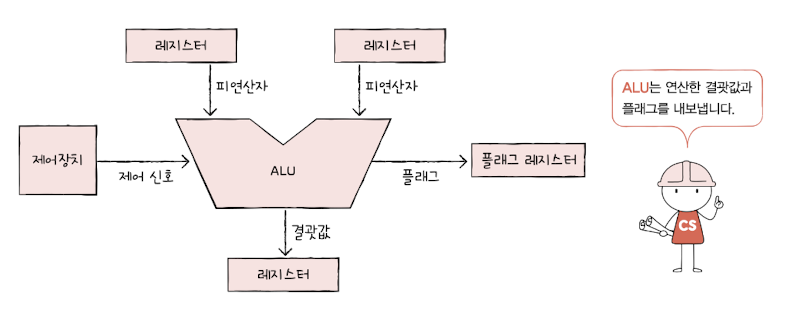
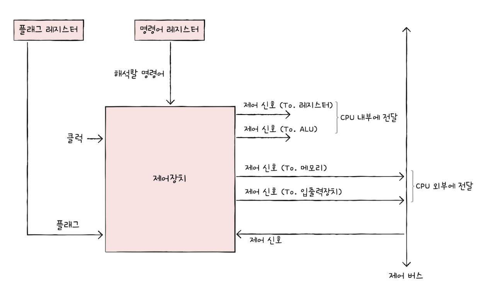
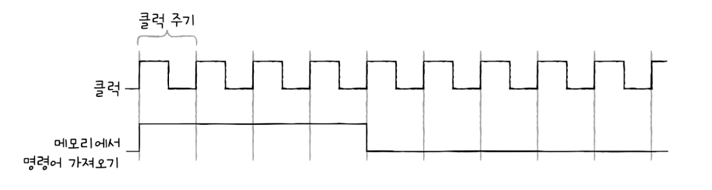

# ALU와 제어장치
**ALU** 는 계산을 맡는 장치이다.

**제어장치** 는 제어 신호를 발생시키고 명령어를 해석하는 장치이다.

## ALU

### ALU가 받아들이는 정보
**ALU** 는 레지스터를 통해 **피연산자** 를 받아들이고, **제어장치** 로부터 수행할 연산을 알려주는 제어 신호를 받아들입니다.

ALU는 레지스터와 제어장치로부터 받아들인 피연산자와 제어 신호로 산술 연산, 논리 연산 등 다양한 연산을 수행합니다.

### ALU가 내보내는 정보
ALU가 연산을 수행한 결과는 특정 숫자나 문자가 될 수도 있고, 메모리 주소가 될 수도 있습니다.

이러한 결괏값은 바로 메모리에 저장되지 않고 일시적으로 **레지스터** 에 저장됩니다.

| CPU가 레지스터에 접근하는 속도가 메모리에 접근하는 속도보다 훨씬 빠르기 때문에 ALU는 결괏값을 메모리가 아닌 레지스터에 우선 저장합니다.

### 플래그
연산 결과에 대한 추가적인 상태 정보를 **플래그(flag)** 라고 합니다.

ALU가 내보내는 대표적인 플래그

- 부호 플래그
  
  연산한 결과의 부호를 나타낸다.

- 제로 플래그

  연산 결과가 0인지 여부를 나타낸다.

- 캐리 플래그

  연산 결과 올림수나 발림수가 발생했는지를 나타낸다 

- 오버플로우 플래그

  오버플로우가 발생했는지를 나타낸다.

- 인터럽트 플래그

  인터럽트가 가능한지를 나타낸다.

- 슈퍼바이저 플레그

  커널 모드로 실행 중인지, 사용자 모드로 실행 중인지를 나타낸다.

이러한 플래그들은 **플래그 레지스터** 라는 레지스터에 저장된다.

ALU 내부에는 여러 계산을 위한 회로들이 있습니다. 대표적으로 덧셈을 위한 가산기, 뺄셈을 위한 보수기, 시프트 연산을 수행해 주는 시프터, 오버플로우를 대비한 오버플로우 검출기 등이 있습니다.

## 제어장치
**제어장치** 는 제어 신호를 내보내고, 명령어를 해석하는 부품

**제어 신호** 는 컴퓨터 부품들을 관리하고 작동시키기 위한 일종의 전기 신호

| 제어장치는 CPU의 구성 요소 중 가장 정교하게 설계된 부품, 제조사마다 구현 방식, 명령어 해석 방식등에 조금씩 차이가 있다.

### 제어장치가 받아들이는 정보
1. 클럭 신호

    **클럭(clock)** 이란 컴퓨터의 모든 부품을 움직일 수 있게 하는 시간 단위 입니다.

    

2. 해석해야 할 명령어

   **명령어 레지스터** 는 CPU가 해석해야 할 명령어를 저장합니다.

3. 플래그 값

    플래그 레지스터 속 플래그 값을 통해 컴퓨터를 제어할 때 필요한 추가 정보를 받아들입니다.

4. 제어 버스로 전달된 제어 신호

    제어 신호는 CPU뿐만 아니라 입출력장치를 비롯한 CPU 외부 장치도 발생시킬 수 있습니다.

**제어장치** 는 클럭, 현재 수행할 명령어, 플래그, 제어 신호를 받아들입니다.

### 제어장치가 내보내는 정보
1. CPU 외부에 전달하는 제어 신호

    입출력장치, 메모리에 전달하는 제어 신호

2. CPU 내부에 전달하는 제어 신호

   ALU, 레지스터에 전달하는 제어 신호
