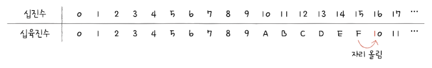

# 데이터

## 0과 1로 숫자를 표현하는 방법

### 정보 단위
**비트(bit)** 란 0과 1을 표현하는 가장 작은 정보 단위이다. 

n비트로 2^n가지의 정보를 표현할 수 있다.

프로그램은 수많은 비트로 이루어져 있다.

**바이트(byte)** 는 여덟 개의 비트를 묶은 정보 단위이다.

1바이트는 2^8(256)개의 정보를 표현할 수 있다.

**워드(word)** 는 CPU가 한 번에 처리할 수 있는 정보의 크기 단위이다.

워드의 절반 크기를 **하프 워드(half word)** , 1배 크기를 **풀 워드(full word)** , 2배 크기를 **더블 워드(double word)** 라고 부른다.

현대 컴퓨터의 워드 크기는 대부분 32비트 또는 64비트이다.

| 인텔의 x86 CPU는 32비트 워드 CPU, x64 CPU는 64비트 워드 CPU이다.

### 이진법
**이진법(binary)** 란 0과 1로 숫자를 표현하는 방법을 의미한다.

숫자 1을 넘어가는 시점에 자리 올림을 함으로써 십진수를 이진수로 표현할 수 있다. 

| 십진수 8은 이진수로 1000 이다.

진법을 표현해주기 위해 이진수 끝에 아래첨자 **(2)** 를 붙이거나 이진수 앞에 **0b** 를 붙인다.

#### 이진수의 음수 표현
이진수에서 음수를 표현하는 방법 중 가장 널리 사용되는 방법은 **2의 보수(two's complement)** 이다.

2의 보수란 '어떤 수를 그보다 큰 2^n에서 뺀 값'을 의미한다.

| 모든 0과 1을 뒤집고 1을 더해 쉽게 2의 보수를 구할 수 있다.

컴퓨터 내부에서 어떤 수를 다룰 때는 양수 음수를 구분하기 위해 **플래그(flag)** 를 사용한다. 

### 십육진법
**십육진법(hexadecimal)** 은 수가 15를 넘어가는 시점에 자리 올림을 하는 숫자 표현 방식이다.

진법을 표현해주기 위해서 십육진수 끝에 아래첨자 **(16)** 를 붙이거나 숫자 앞에 **0x** 를 붙여 구분한다.

#### 십육진수를 이진수로 변환하기

#### 이진수를 십육진수로 변환하기 

| 하드웨어와 밀접하게 맞닿아 있는 개발 분야에서는 실제로 코드에 십육진수를 직접 쓰는 경우도 있다.

## 0과 1로 문자를 표현하는 방법

### 문자 집합과 인코딩
**문자 집합(character set)** 이란 컴퓨터가 인식하고 표현할 수 있는 문자의 모음을 의미한다.

**문자 인코딩(character encoding)** 이란 문자를 0과 1로 변환하여 컴퓨터가 이해할 수 있게 만드는 과정을 의미한다.

**문자 디코딩(character decoding)** 이란 인코딩의 반대 과정, 0과 1로 표현된 문자를 사람이 이해할 수 있는 문자로 변환하는 과정을 의미한다.

### 아스키 코드
**아스키(ASCII, American Standard Code for Information Interchange)** 란 초창기 문자 집합 중 하나로, 영어 알파벳과 아라비아 숫자, 그리고 일부 특수 문자를 포함한다.

아스키 코드는 7비트로 이루어져있으며, 하나의 문자를 표현한다.

| 실제로 하나의 아스키 문자를 나타내기 위해 8비트(1바이트)를 사용하지만 이 중 1비트는 패리티 비트(parity bit)라고 불리는, 오류 검출용 비트이다.

문자 인코딩에서 '글자에 부여된 고유한 값'을 **코드 포인트(code point)** 라고 부른다.

아스키 코드는 이렇듯 간단하게 인코딩된다는 장점이 있지만 특성상 한글을 포함한 다른 언어 문자, 다양한 특수 문자는 표현이 불가하다는 단점이 있다.

| 아스키 코드에 1비트를 추가한 8비트의 **확장 아스키(Extended ASCII)** 가 등장하기도 했지만 그럼에도 한계는 명확했다. 

### EUC-KR
한글의 특징을 이용한 새로운 인코딩 방식이 필요 했고 결과적으로 완성형(한글 완성형 인코딩)과 조합형(한글 조합형 인코딩)이 존재하게 되었다.

| 한글 한 글자에 2바이트의 코드가 부여된다.

- 완성형은 완성된 단어 하나에 코드를 부여한다.

- 조합형은 초성 중성 종성마다 코드를 부여한다.

**EUC-KR** 이란 KS X 1001, KS X 1003이라는 문자 집합을 기반으로 하는 대표적인 완성형 인코딩 방식이다.

2350개 정도의 한글 단어를 표현할 수 있게 되었지만 모든 한글 조합을 표현할 수 없다는 한계가 존재했다.

**CP949(Code Page 949)** EUC-KR의 확장된 버전으로 마이크로소프트가 개발하였지만 이마저도 여전히 한계가 존재했다.

### 유니코드와 UTF-8 
언어별로 인코딩을 나라마다 해야 한다면 다국어를 지원해야하는 프로그램을 만들 때 번거로움이 있을 것이다. 

**유니코드(unicode)** 문자 집합은 훨씬 더 많은 양의 문자를 코드로 표현할 수 있는 통일된 문자 집합이다.

**UTF(Unicode Transform Format)** 이란 유니코드를 인코딩하는 방법을 의미한다. 

유니코드에는 인코딩 방식에 따라 UTF-8, UTF-16, UTF-32등으로 나뉜다.

