# 명령어

## 소스 코드와 명령어
모든 소스 코드는 컴퓨터 내부에서 명령어로 변환된다.

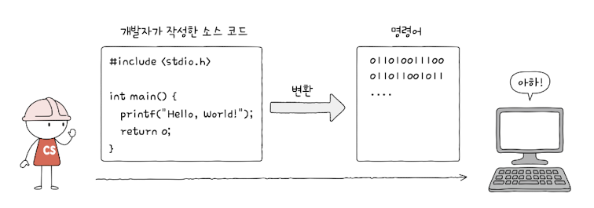

### 고급 언어와 저급 언어
- 고급 언어 (high-level programming language)
  
  개발자가 이해하기 쉽게 만든 언어 (C, C++, Java, Python...)

- 저급 언어 (low-level programming language)
  
  컴퓨터가 이해하고 실행하는 언어 (기계어, 어셈블리어)

  - 기계어 (machine code)
    
    0과 1의 명령어 비트로 이루어진 언어

    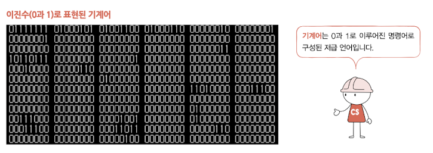
  
  - 어셈블리어 (assembly language)

    기계어를 읽기 편한 형태로 번역한 언어

    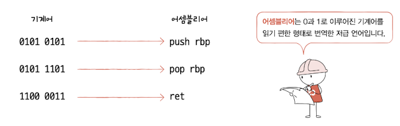

| 저급 언어를 알면 컴퓨터가 프로그램을 어떤 과정으로 실행하는지 추적하고 관찰할 수 있습니다. 

### 컴파일 언어와 인터프리터 언어
고급 언어를 저급 언어로 변환시크는 방법에는 크게 두 가지가 있습니다.

**컴파일** 방식과 **인터프리트** 방식이 바로 그것입니다.

이에따라 컴파일 방식으로 작동하는 프로그래밍 언어를 **컴파일 언어** , 인터프리트 방식으로 작동하는 프로그래밍 언어를 **인터프리터 언어** 라고 합니다. 

- 컴파일 언어

  컴파일러에 의해 소스 코드 전체가 저급 언어로 변환되어 실행되는 언어

  컴파일 언어로 작성된 코드 전체가 저급 언어로 변환되는 과정을 **컴파일 (compile)** 이라고 한다. 이때 컴파일을 수행해 주는 도구를 **컴파일러 (compiler)** 라고 한다.

  컴파일러를 통해 저급 언어로 변환된 코드를 **목적 코드 (object code)** 라고 한다.

  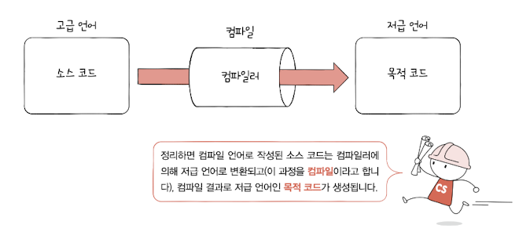

- 인터프리터 언어

  인터프리터에 의해 소스 코드가 한 줄씩 실행되는 언어

  소스 코드를 한 줄씩 저급 언어로 변환하여 실행해 주는 도구를 **인터프리터 (interpreter)** 라고 한다.

  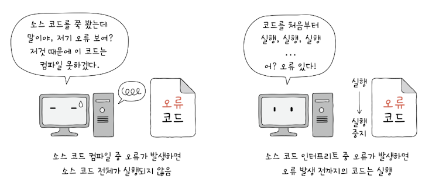

| 현대의 많은 프로그래밍 언어 중에는 컴파일 언어와 인터프리터 언어 간의 경계가 모호한 경우가 많다.

### 목적 파일 vs 실행 파일
목적 코드로 이루어진 **목적 파일** 을 실행하기 위해서는 **실행 파일** 로 만들 필요가 있다.

목적 파일이 실행 코드가 되기 위해서는 **링킹(linking)** 이라는 작업을 거쳐야 한다.

## 명령어의 구조

### 연산 코드와 오퍼랜드
**명령어** 는 연산 코드와 오퍼랜드로 구성되어 있습니다.

- **연산 코드(operation code)**
  
  명령어가 수행할 연산이 담긴 코드

  기본적인 연산 코드 유형

  1. 데이터 전송
  2. 산술/논리 연산
  3. 제어 흐름 변경
  4. 입출력 제어
  
 

- **오퍼랜드(operand)**

  연산에 사용할 데이터 또는 연산에 사용할 데이터가 저장된 위치

| 연산 코드는 **연산자** , 오퍼랜드는 **피연산자** 라고도 부릅니다.

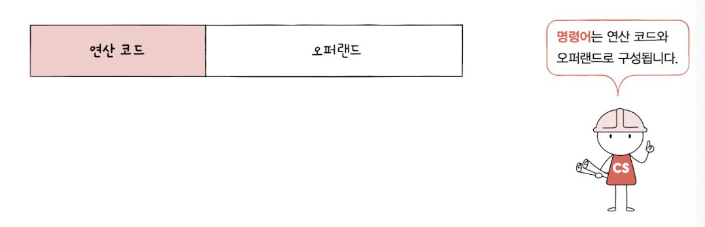

### 주소 지정 방식
명령어의 오퍼랜드 필드에 직접적인 데이터가 아닌 메모리나 레지스터의 주소를 담는 경우 많다. 따라서 오퍼랜드 필드를 **주소 필드** 라고 부르기도 한다.

명령어의 길이 때문에 오퍼랜드에 많은 공간을 할당할 수가 없다. 따라서 오퍼랜드에는 직접적인 값 보다 메모리나 레지스터의 **주소** 를 많이 할당한다.

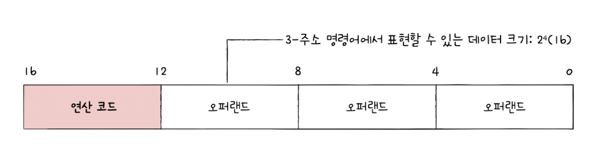

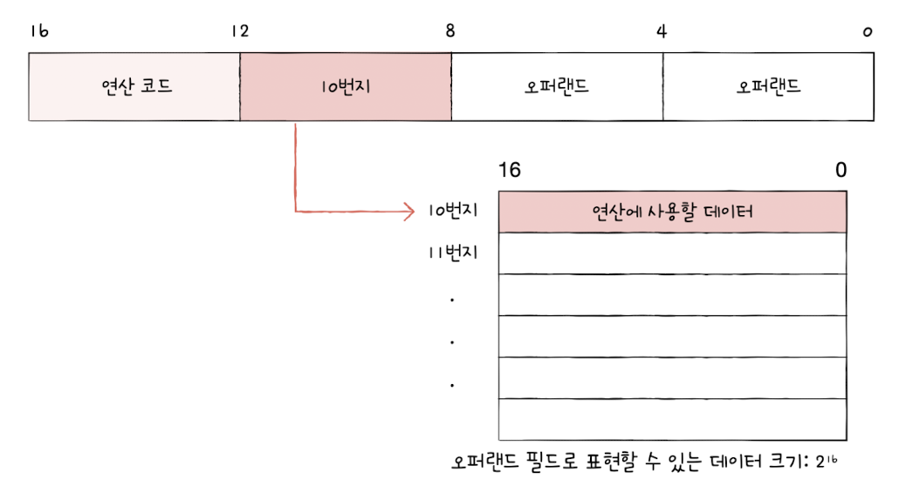

- **유효 주소(effective address)**

  연산 코드에 사용할 데이터가 저장된 위치

- **주소 지정 방식(addressing mode)**

  오퍼랜드 필드에 데이터가 저장된 위치를 명시할 때 연산에 사용할 데이터 위치를 찾는 방법

  대표적인 주소 지정 방식 5가지

  - **즉시 주소 지정 방식(immediate addressing mode)**
  
    연산에 사용할 데이터를 오퍼랜드 필드에 직접 명시하는 방법

    표현할 수 있는 데이터의 크기가 작지만, 메모리나 레지스터로부터 찾는 과정이 없기 때문에 다른 주소 지정 방식들에 비해 빠르다.

    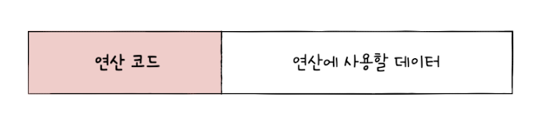

  - **직접 주소 지정 방식(direct addressing mode)**

    오퍼랜드 필드에 유효 주소를 직접적으로 명시하는 방법

    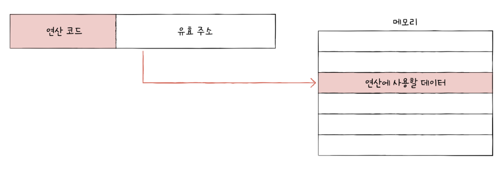

  - **간접 주소 지정 방식(indirect addressing mode)**

    유효 주소의 주소를 오퍼랜드 필드에 명시하는 방법

    표현할 수 있는 유효 주소의 범위가 넓어졌지만, 두 번의 메모리 접근이 필요하기 때문에 앞의 방식들에 비해 일반적으로 속도가 느리다.

    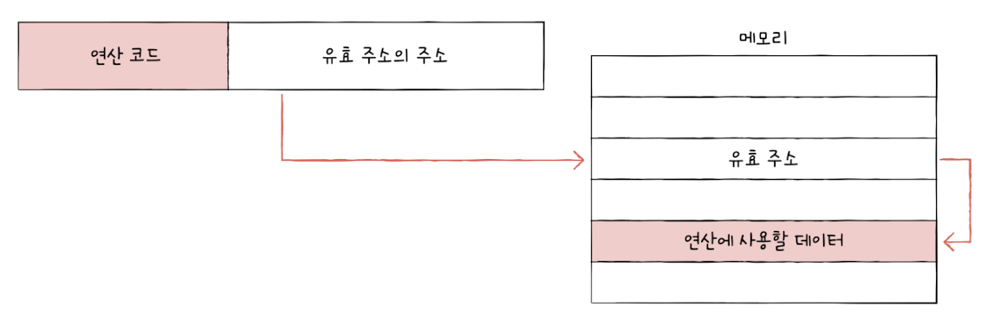

  - **레지스터 주소 지정 방식(register addressing mode)**

    연산에 사용할 데이터를 저장한 레지스터를 오퍼랜드 필드에 직접 명시하는 방법

    일반적으로 CPU 외부에 있는 메모리에 접근하는 것보다 CPU 내부에 있는 레지스터에 접근하는 것이 더 빠르다. 따라서 레지스터 주소 지정 방식은 보다 빠르게 데이터에 접근할 수 있다.

    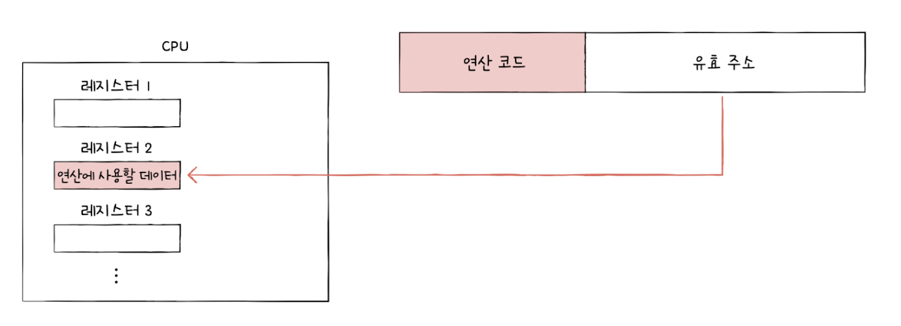

  - **레지스터 간접 주소 지정 방식(register indirect addressing mode)**

    연산에 사용할 데이터를 메모리에 저장하고, 그 주소(유효 주소)를 저장한 레지스터를 오퍼랜드 필드에 명시하는 방법.

    간접 주소 지정 방식과 비슷하지만, 메모리에 접근하는 횟수가 한 번으로 줄어든다는 차이가 있다.

    

### 스택과 큐

- **스택(stack)**
  
  한쪽 끝이 막혀 있는 저장 공간

  스택은 '나중에 저장한 데이터를 가장 먼저 빼내는 데이터 관리 방식(후입선출)' 이라는 점에서 **LIFO(Last In First Out)** 자료 구조라고도 부른다.

  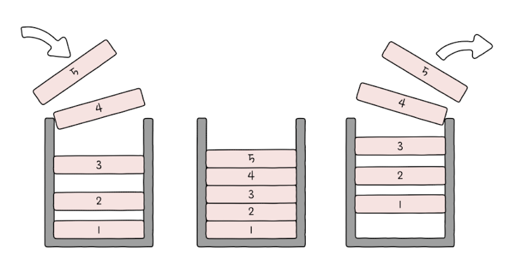

- **큐(queue)**
  
  스택과는 달리 양쪽이 뚫려 있는 저장 공간

  큐는 '가장 먼저 저장된 데이터부터 빼내는 데이터 관리 방식(선입선출)' 이라는 점에서 **FIFO(First In First Out)** 자료 구조라고도 부른다.

  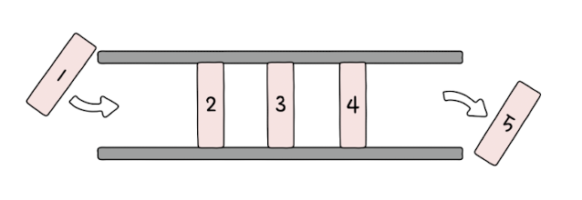